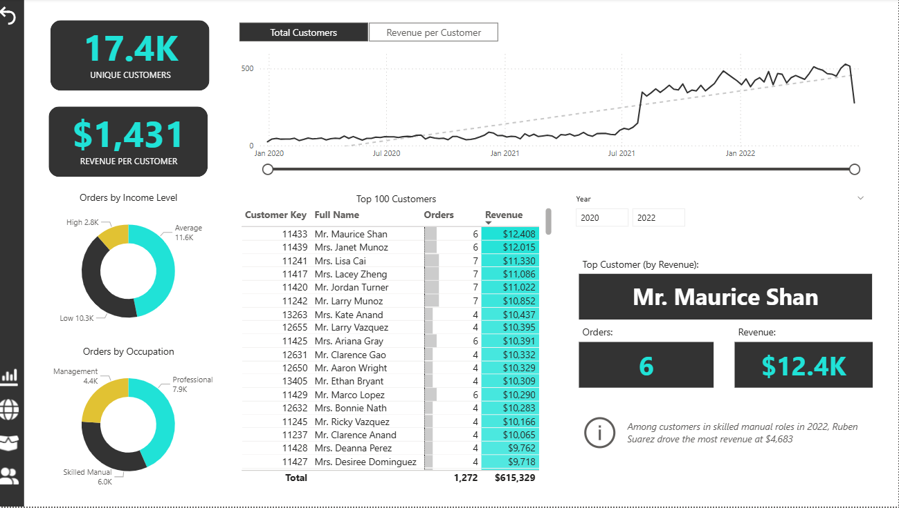

# Power_BI_Analysis

# 📊 Adventure Works Sales Dashboard | Power BI Project

## 🚀 Project Summary
Developed an end-to-end Business Intelligence solution using the Adventure Works dataset to analyze sales performance, customer behavior, and product trends. 

This project demonstrates strong skills in **data transformation, data modeling, and interactive dashboard development** to support data-driven decision-making.

---

## 🎯 Business Objectives
- Analyze overall sales performance
- Identify top-performing products and regions
- Track monthly and yearly sales trends
- Understand customer purchasing behavior

---

## 🛠️ Tech Stack
- **Power BI** – Data Visualization & Dashboard
- **Power Query** – Data Cleaning & Transformation
- **DAX** – Calculated Measures & KPIs
- **Data Modeling** – Star Schema Design

---

## 📂 Data Processing Workflow

### 🔹 Data Cleaning (Power Query)
- Removed null and duplicate records  
- Standardized column formats  
- Created derived columns for analysis  

### 🔹 Data Modeling
- Built **Star Schema** for optimized performance  
- Established relationships between fact and dimension tables  
- Created measures using DAX (Revenue, Profit, Growth)

### 🔹 Dashboard Development
- Designed interactive and user-friendly dashboard  
- Implemented slicers and filters for dynamic analysis  

---

## 📈 Key Insights
- Identified top revenue-generating products and categories  
- Found highest sales contribution by specific regions  
- Observed seasonal trends in sales performance  
- Analyzed customer segments for better targeting  

---

## 🖥️ Dashboard Features
✔ KPI Cards (Revenue, Profit, Orders)  
✔ Time-series analysis (Monthly/Yearly trends)  
✔ Top N products & categories  
✔ Region-wise performance analysis  
✔ Interactive filters & slicers  

---

## 🖼️ Dashboard Preview
(Add your screenshot here)

---

## 📎 How to Run
1. Download the `.pbix` file  
2. Open using Power BI Desktop  
3. Refresh data if required  

---

## 💡 Key Learnings
- Hands-on experience with real-world BI workflow  
- Improved data modeling and DAX skills  
- Ability to convert raw data into actionable insights  

---

## 👨‍💻 Author
**Sambit Kumar Barik**  
Aspiring Data Analyst | Power BI Developer  

---

## ⭐ Support
If you found this project helpful, please give it a ⭐ on GitHub!
